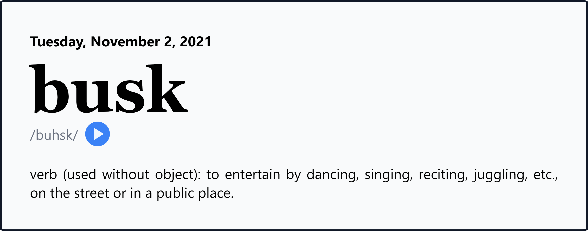

# word-of-the-day

A static website which fetches Dictionary's [word of the day](https://www.dictionary.com/e/word-of-the-day/) and displays it along with its definition.

## /dev/notes

This is probably my first time making a decent looking responsive website in pure css and js (not including the material icons). I usually use bootstrap or tailwind and jquery or svelte so this was a first for me.

To me, developing in pure css/js is like programming in C++. It's fun, but it takes some time to get used to.